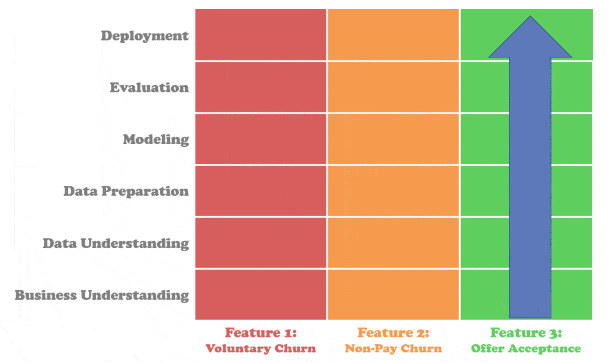
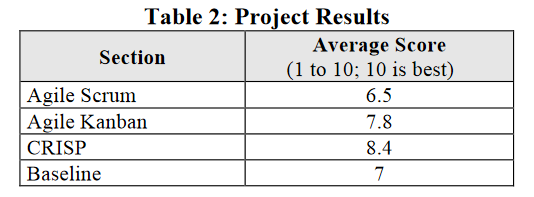
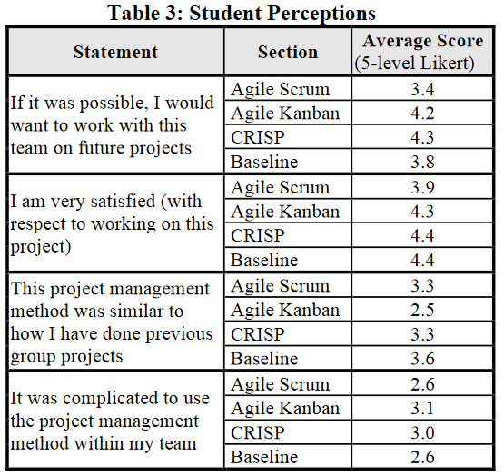
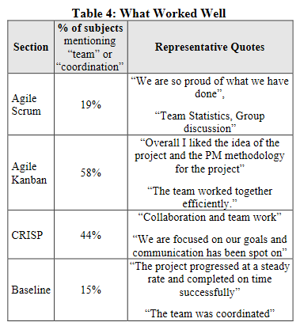

# Rascunho

Recortes de sites e artigos (cross-reference).

  

## [[1] What is CRISP DM?](https://www.datascience-pm.com/crisp-dm-2/) (2023)

A process model that serves as the base for a data science process. It has six sequential phases:

    1) Business understanding – What does the business need?
    2) Data understanding – What data do we have / need? Is it clean?
    3) Data preparation – How do we organize the data for modeling?
    4) Modeling – What modeling techniques should we apply?
    5) Evaluation – Which model best meets the business objectives?
    6) Deployment – How do stakeholders access the results?

- Fase 1: Business understanding
    - Focuses on understanding the objectives and requirements of the project. Aside from the third task, the three other tasks in this phase are foundational project management activities that are universal to most projects:
        - A) Determine business objectives: You should first “thoroughly understand, from a business perspective, what the customer really wants to accomplish.” (CRISP-DM Guide) and then define business success criteria.
        - B) Assess situation: Determine resources availability, project requirements, assess risks and contingencies, and conduct a cost-benefit analysis.
        - C) Determine data mining goals: In addition to defining the business objectives, you should also define what success looks like from a technical data mining perspective.
        - D) Produce project plan: Select technologies and tools and define detailed plans for each project phase

- Fase 2: Data Understanding
    - Adding to the foundation of Business Understanding, it drives the focus to identify, collect, and analyze the data sets that can help you accomplish the project goals. This phase also has four tasks:
        - A) Collect initial data: Acquire the necessary data and (if necessary) load it into your analysis tool.
        - B) Describe data: Examine the data and document its surface properties like data format, number of records, or field identities.
        - C) Explore data: Dig deeper into the data. Query it, visualize it, and identify relationships among the data.
        - D) Verify data quality: How clean/dirty is the data? Document any quality issues.

- Fase 3: Data Preparation
    - This phase has five tasks:
        - A) Select data: Determine which data sets will be used and document reasons for inclusion/exclusion.
        - B) Clean data: Often this is the lengthiest task. Without it, you’ll likely fall victim to garbage-in, garbage-out. A common practice during this task is to correct, impute, or remove erroneous values.
        - C) Construct data: Derive new attributes that will be helpful. For example, derive someone’s body mass index from height and weight fields.
        - D) Integrate data: Create new data sets by combining data from multiple sources.
        - E) Format data: Re-format data as necessary. For example, you might convert string values that store numbers to numeric values so that you can perform mathematical operations.

- Fase 4: Modeling
    - Build and assess various models based on several different modeling techniques. This phase has four tasks:
        - A) Select modeling techniques: Determine which algorithms to try (e.g. regression, neural net).
        - B) Generate test design: Pending your modeling approach, you might need to split the data into training, test, and validation sets.
        - C) Build model: As glamorous as this might sound, this might just be executing a few lines of code like “reg = LinearRegression().fit(X, y)”.
        - D) Assess model: Generally, multiple models are competing against each other, and the data scientist needs to interpret the model results based on domain knowledge, the pre-defined success criteria, and the test design.
    - Although the CRISP-DM Guide suggests to “iterate model building and assessment until you strongly believe that you have found the best model(s)”,  in practice teams should continue iterating until they find a “good enough” model, proceed through the CRISP-DM lifecycle, then further improve the model in future iterations.

- Fase 5: Evaluation
    - Looks more broadly at which model best meets the business and what to do next. This phase has three tasks:
        - A) Evaluate results: Do the models meet the business success criteria? Which one(s) should we approve for the business?
        - B) Review process: Review the work accomplished. Was anything overlooked? Were all steps properly executed? Summarize findings and correct anything if needed.
        - C) Determine next steps: Based on the previous three tasks, determine whether to proceed to deployment, iterate further, or initiate new projects.

- Fase 6: Deployment
    - This final phase has four tasks:
        - A) Plan deployment: Develop and document a plan for deploying the model.
        - B) Plan monitoring and maintenance: Develop a thorough monitoring and maintenance plan to avoid issues during the operational phase (or post-project phase) of a model.
        - C) Produce final report: The project team documents a summary of the project which might include a final presentation of data mining results.
        - D) Review project: Conduct a project retrospective about what went well, what could have been better, and how to improve in the future.

CRISP-DM Agile: Vertical Slicing:

## [[1.1] Agile Data Science](https://www.datascience-pm.com/agile-data-science/) (2023)

Simply put, Agile Data Science merges Agile philosophies with data science practices.

It does not shoehorn data science into practices that compromise the natural data science life cycle.

Rather Agile data science respects data science for what it is — a highly exploratory process centered around scientific experimentation.

Although Agile’s underlying philosophy is the same for data science as in other industries, there are some important nuances for what this means in practice for data science

- Benefits of Agile Data Science:
    - More Relevant Deliverables: By defining requirements just before development (as opposed to all upfront in a project), the features are more likely to meet the most current needs. Indeed, the stakeholders’ initial requests often do not map to their needs. Agile practices help you discover the true needs earlier.
    - Quicker Delivery of Customer Value: By delivering incremental product features such as exploratory data reports, Tableau dashboards, or Minimal Viable Models, users gain value before the project’s end.
    - Real Feedback: By soliciting feedback on the functional product, the data scientists can more accurately assess whether their deliverables work “in the wild”. Meanwhile, the product manager can assess whether the deliverables provide the intended business value.
    - Cut Losses Early: No matter what you do, some data science projects simply fail. The sooner you get feedback that you’re headed to failure, the sooner you can pivot to related objectives or kill off the project.
    - Improved Communication: Agile focuses on individuals, collaboration, and clear communication. As data science teams scale and become more diverse, the benefits of effective communication also increase — both within the team and with the stakeholders.

## [[1.2] CRISP-DM – a Standard Methodology to Ensure a Good Outcome](https://www.datasciencecentral.com/crisp-dm-a-standard-methodology-to-ensure-a-good-outcome/) (2016)

To ensure quality in your data science group, make sure you’re enforcing a standard methodology.

The process or methodology of CRISP-DM is described in these six major steps:

    1) Business Understanding: Focuses on understanding the project objectives and requirements from a business perspective, and then converting this knowledge into a data mining problem definition and a preliminary plan.
    2 )Data Understanding: Starts with an initial data collection and proceeds with activities in order to get familiar with the data, to identify data quality problems, to discover first insights into the data, or to detect interesting subsets to form hypotheses for hidden information.
    3) Data Preparation: The data preparation phase covers all activities to construct the final dataset from the initial raw data.
    4) Modeling: Modeling techniques are selected and applied.  Since some techniques like neural nets have specific requirements regarding the form of the data, there can be a loop back here to data prep.
    5) Evaluation: Once one or more models have been built that appear to have high quality based on whichever loss functions have been selected, these need to be tested to ensure they generalize against unseen data and that all key business issues have been sufficiently considered.  The end result is the selection of the champion model(s).
    6) Deployment: Generally this will mean deploying a code representation of the model into an operating system to score or categorize new unseen data as it arises and to create a mechanism for the use of that new information in the solution of the original business problem.  Importantly, the code representation must also include all the data prep steps leading up to modeling so that the model will treat new raw data in the same manner as during model development.

In our recent article ([1.2.1](#121-3-tips-for-getting-the-most-out-of-your-data-science-team-2016)) about getting the most out of your data science team, we argued that if you are responsible for a data science group, one of your main tools for quality and efficiency is to ensure that a common methodology is being used.

For non-Traditional modeling projects like Deep Learning or Sentiment Analysis, all these projects need to be evaluated for their ability to generalize in the real world.  So yes, CRISP-DM provides strong guidance for even the most advanced of today’s data science activities.

## [[1.2.1]  3 Tips for Getting the Most Out of Your Data Science Team](https://www.datasciencecentral.com/3-tips-for-getting-the-most-out-of-your-data-science-team/) (2016)

1) Common Platform: There’s no longer a place for the lone wolf data scientist in an advanced analytics shop.  That almost assuredly means that you’ve needed to drive them toward a common advanced analytics platform.  Could be R or Python, or it could be SAS, SPSS, or one of the other proprietaries, but you can’t have everybody doing their own thing. Unless everybody’s speaking the same language the communication will suffer, meaning fewer minds can share a problem and that there’s less supervision and collaboration. 

2) Common Methodology: All data scientists are originally raised with certain principles and these are most commonly embodied in the CRISP-DM methodology (Cross Industry Standard Process for Data Mining).  I had the pleasure of helping to develop this back in the 90s and there’s nothing magic here, just good common sense.  But unless you have an agreed methodology and enforce it, you won’t know who is cutting corners and with what consequences.

3) How Much Accuracy Do You Need? Start keeping some metrics and figure out how long it is taking for your data scientists to produce models. Some problems are tougher than others but you can figure out the categories and which are comparable. The question is at what point did the cost of that increase in accuracy break even with the business value?  In many modeling situations especially those that involve buying behavior the breakeven is fairly straightforward to calculate.

## [[1.3] Comparing Data Science Project Management Methodologies via a Controlled Experiment](https://scholarspace.manoa.hawaii.edu/server/api/core/bitstreams/07ccfe0d-2ab8-44ce-945a-6a02da486468/content) (2017)

Step-by-step view on how to do data science has not materially evolved in the past 20 years. For example, they are similar to the KDD (Knowledge Discovery in Databases) process described  nearly twenty years ago [9]. In another example, the CRISP-DM (Cross Industry Standard Process for Data Mining) might also be viewed as a possible first step towards defining a data science methodology. CRISP-DM was established in the 1990s, and is a data mining process model for data mining experts [10]. The model mentions six high-level phases: business understanding, data understanding, data preparation, modeling, evaluation, and deployment. SEMMA [11] is the second most popular methodology, and consist of tasks such as: sampling, exploring, modifying,
modeling, assessing. While these process models differ in details, at a high level they are broadly similar. We note though that no model seems to have achieved wide acceptance. For example, there has been a reported decrease within the KDD community of people using CRISP-DM and SEMMA, and an increase in people using their own methodology [12].

Perhaps a bit surprisingly, the Agile Scrum methodology was actually worse than the Baseline condition. Why not Agile Scrum? First, it was a difficult process for a team to fully utilize. In addition, task estimation was very difficult. Why was Agile Kanban effective? Perhaps it was due to its’ culture of continuous improvement. Why was the CRISP model effective? It was a very natural way of conducting the projects: understanding, analysis, etc. and making loops/iterations if necessary. It is also interesting to note that the students’ without an assigned methodology started to converge into a CRISP-like methodology.

## [[1.4] Big data team process methodologies: A literature review and the identification of key factors for a project's success](https://ieeexplore.ieee.org/abstract/document/7840936) (2017)

> paywall

## [[1.5] Predicting data science sociotechnical execution challenges by categorizing data science projects](https://asistdl.onlinelibrary.wiley.com/doi/abs/10.1002/asi.23873) (2017)

> paywall

## [[2] ???](https://www.sv-europe.com/crisp-dm-methodology/#one)

## [[3] ???](https://medium.com/international-school-of-ai-data-science/project-management-in-data-science-using-crisp-dm-54ee35a5f4f3)

## [[4] ???](https://www.datascience-pm.com/crisp-dm-for-data-science-teams-5-actions-to-consider/)

## [[5] ???](https://agilethought.com/blogs/scaling-data-science-use-crisp-dm-agile/)

## [[6] ???](https://www.cognilytica.com/how-to-apply-crisp-dm-to-ai-and-big-data-projects/)

## [[7] ???](https://www.cognilytica.com/why-cant-i-use-agile-or-crisp-dm-to-manage-ai-and-data-projects/)

## [[8] ???](https://www.sydle.com/br/blog/pmbok-61e80383f41fbf069eb3ef2b)

## [[9] ???](https://blog.ipog.edu.br/engenharia-e-arquitetura/ser-gerente-de-projetos-6-dicas-para-se-tornar-um/)

## [[10] ???](https://blog.aevo.com.br/pmbok/)

## [[99] ???]()

## [[99] ???]()

## [[99] ???]()

## [[99] ???]()

## [[99] ???]()

