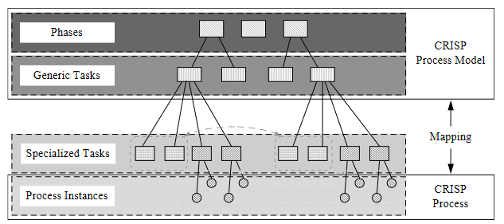
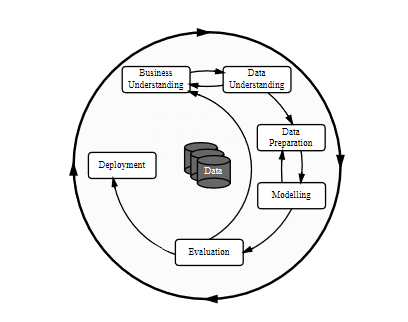
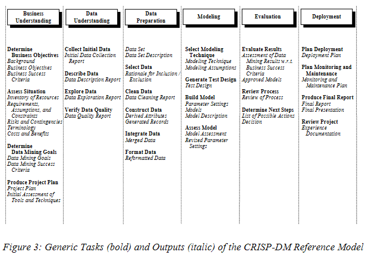
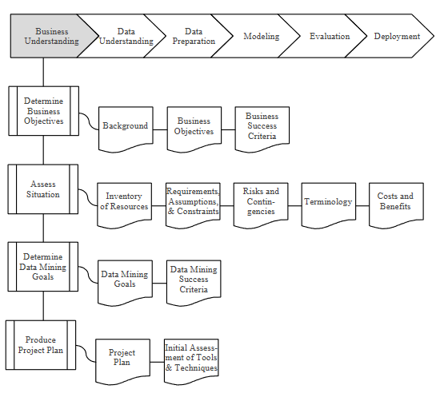
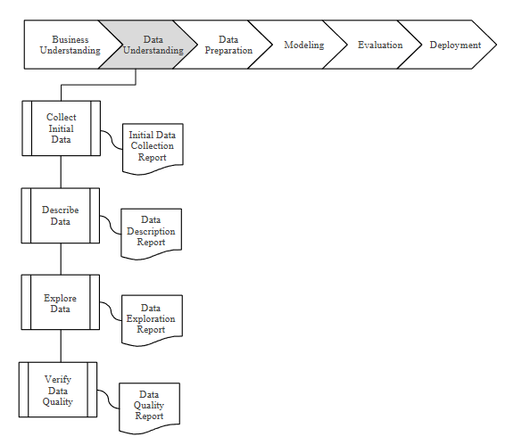
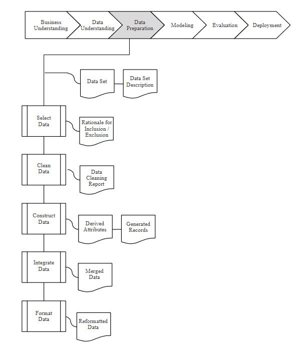
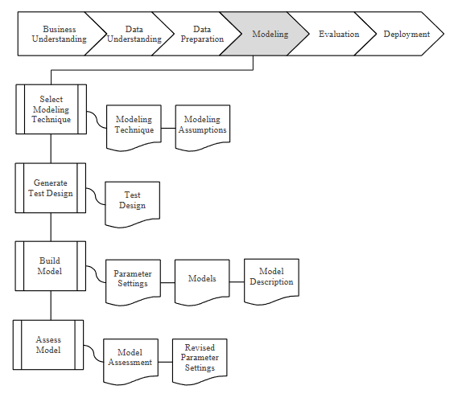
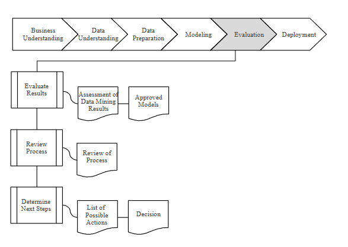
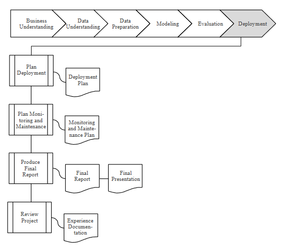

# CRISP-DM - CRISP-DM Paper (1999) & CRISP-DM Step-by-step (2000)

**I) Introduction**

___

**II) Reference Model**

1) Business Understanding: This initial phase focuses on understanding the project objectives and requirements
from a business perspective, and then converting this knowledge into a data mining
problem definition, and a preliminary plan designed to achieve the objectives.

    

    - Outputs for each task:
        - A) Business Objectives; and Business Success Criteria
        - B) Inventory of Resources; Requirements, Assumptions, and Constraints; Risks and Contingencies; Terminology; and Costs and Benefits
        - C) Data Mining Goals; Data Mining Success Criteria
        - D) Project Plan; and Initial Assessment of Tools and Techniques

2) Data Understanding: The data understanding phase starts with an initial data collection and proceeds with
activities in order to get familiar with the data, to identify data quality problems, to
discover first insights into the data, or to detect interesting subsets to form hypotheses
for hidden information.

    

    - Outputs for each task:
        - A) Initial Data Collection Report
        - B) Data Description Report
        - C) Data Exploration Report
        - D) Data Quality Report

3) Data Preparation: The data preparation phase covers all activities to construct the final dataset (data that
will be fed into the modeling tool(s)) from the initial raw data. Data preparation tasks
are likely to be performed multiple times, and not in any prescribed order. Tasks
include table, record, and attribute selection as well as transformation and cleaning of
data for modeling tools.

    

    - Outputs for each task: Data Set  and Data Set Description
        - A) Rationale for Inclusion/Exclusion
        - B) Data Cleaning Report
        - C) Derived Attributes; and Generated Records
        - D) Merged Data
        - E) Reformatted Data

4) Modeling: In this phase, various modeling techniques are selected and applied, and their
parameters are calibrated to optimal values. Typically, there are several techniques for
the same data mining problem type. Some techniques have specific requirements on
the form of data. Therefore, stepping back to the data preparation phase is often
needed.

    

    - Outputs for each task:
        - A) Modeling Technique; and Modeling Assumptions
        - B) Test Design
        - C) PArameter Settings; Models; and Model Description
        - D) Model Assessment; and Revised Parameter Settings

5) Evaluation: At this stage in the project you have built a model (or models) that appears to have
high quality, from a data analysis perspective. Before proceeding to final deployment
of the model, it is important to more thoroughly evaluate the model, and review the
steps executed to construct the model, to be certain it properly achieves the business
objectives. A key objective is to determine if there is some important business issue
that has not been sufficiently considered. At the end of this phase, a decision on the
use of the data mining results should be reached.

    

    - Outputs for each task:
        - A) Assessment of Data Mining Results w.r.t. Business Success Criteria; and Approved Models
        - B) Review of Process
        - C) List of Possible Actions; and Decision

6) Deployment Creation of the model is generally not the end of the project. Even if the purpose of
the model is to increase knowledge of the data, the knowledge gained will need to be
organized and presented in a way that the customer can use it. Depending on the
requirements, the deployment phase can be as simple as generating a report or as
complex as implementing a repeatable data mining process. In many cases it will be
the customer, not the data analyst, who will carry out the deployment steps. However,
even if the analyst will not carry out the deployment effort it is important for the
customer to understand up front what actions will need to be carried out in order to
actually make use of the created models

    

    - Outputs for each task:
        - A) Deployment Plan
        - B) Monitoring and Maintenance Plan
        - C) Final Report; and Final Presentation
        - D) Experience Documentation

___

**III) User Guide**

1) Bsiness Understanding:
    - Beware of setting unattainable goals – make them as realistic as possible;
    - Each of the success criteria should relate to at least one of the specified Business Objectives;
    - Remember that the project may need technical staff at odd times throughout the project. E.g. during Data Transformation;
    - The list of assumptions also includes assumptions at the beginning of the project, i.e., what has been the starting point of the project;
    - Remember to identify hidden costs such as repeated data extraction and preparation, changes in work flows, and training time during learning;
    - Remember that the Data Mining Success Criteria will be different to the Business Success Criteria defined earlier;
    - Remember that it is wise to plan for deployment already at the start of the project;

2) Data Understanding:
    - Be aware that data collected from different sources may give rise to quality problems when merged (e.g. address files merged with own customer base may show up inconsistencies of format, invalidity of data, etc;

3) Data Preparation:
    - Remember that some fields may be irrelevant to the data mining goals and therefore noise in those fields has no significance. However, if noise is ignored for these reasons, it should be fully documented as the circumstances may change later!
    - Before adding Derived Attributes, try to determine if and how they will ease the model process or facilitate the modelling algorithm, Perhaps “income per head” is a better/easier attribute to use that “income per household”. Do not derive attributes simply to reduce the number of input attributes;
    - Another type of derived attribute is single-attribute transformations, usually performed to fit the needs of the modelling tools;
    - Transformations may be necessary to transform ranges to symbolic fields (e.g. ages to age ranges) or symbolic fields (“definitely yes”, “yes”, “don’t know”, “no”) to numeric values. They are often required by the modelling tools or algorithm;
    - Remember that some knowledge may be contained in non-electronic format;

4) Modeling:
    - “Lift Tables” and “Gain Tables” can be constructed to determine how well the model is predicting;

5) Evaluation:
    - RESULTS = MODELS + FINDINGS
    - List of possible further actions along with the reasons for and against each option

6) Deployment:
    - Develop and evaluate alternative plans for deployment;
