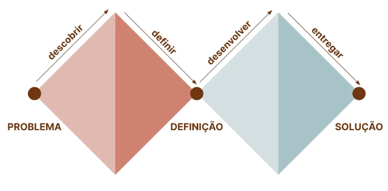
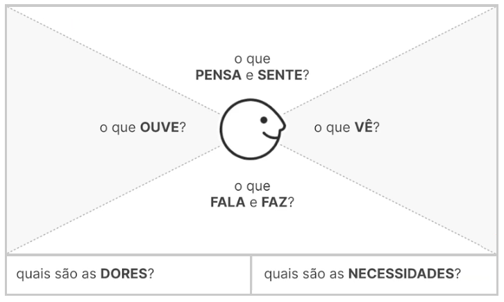
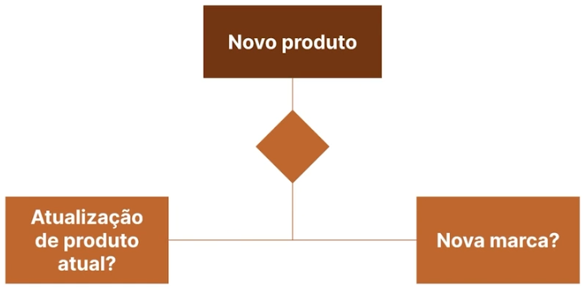
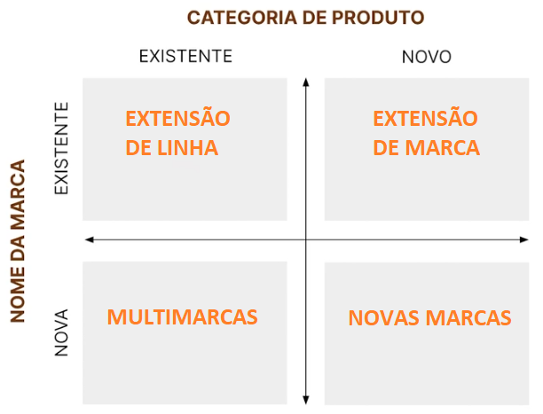
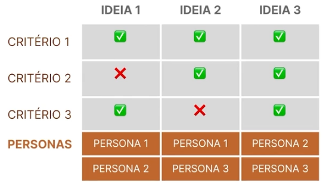
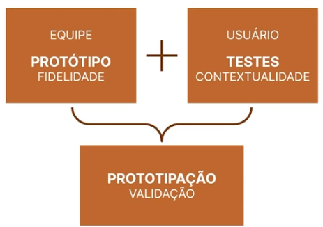
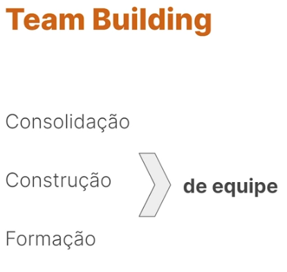
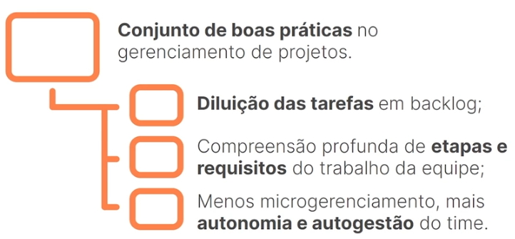
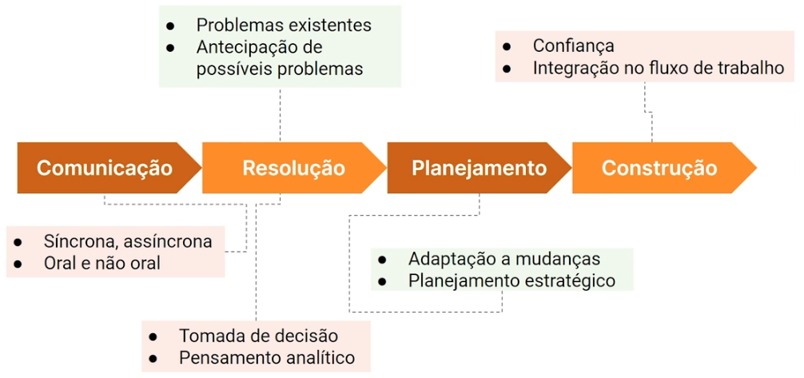

# Agilidade e Dados

<!--

https://unibb.alura.com.br/course/gestao-agil-conceitos-agilidade

-->

## Metodologias & Frameworks

Metodologias são mais rídigas, enquanto frameworks são permeáveis para que o usuário, ou gestor, adeque a sua realidade. Um método é uma abordagem geral para a gestão de projetos.

## Lean: Foco na eficiência
- Fluxo contínuo
- Melhoria contínua
- Ciclos de entrega de valor

## Ágil: Foco no cliente

- [Manifesto Ágil](https://agilemanifesto.org/):
    - Individuals and interactions over processes and tools
    - Working software over comprehensive documentation
    - Customer collaboration over contract negotiation
    - Responding to change over following a plan

- Princípios:
    - Satisfação do cliente
    - Receptivo as alterações
    - Entregas frequentes
    - Colaboração
    - Motivação individual
    - Comunicação ativa
    - Corresponder à medida de progresso
    - Promover o desenvolvimento sustentável
    - Atenção frequente a excelência
    - Simplicidade é essencial
    - Equipes auto-organizadas
    - Reflexões regulares de melhoria

___

Cultura de experimentação e MVPs são bem vindos (ver [What is CRISP DM?](00_rascunho.md#1-what-is-crisp-dm-2023)).

Enfatizar a colaboração e propiciar um ambiente sinérgico e comunicativo. Não reforçar a _Cultura do Herói_. Promover a diversidade de ideias e compartilhamento de responsabilidades.

## Gestão 3.0:

- Autonomia
- Colaboração
- Melhoria contínua
- Liderança distribuída
- Cultura de confiança e transparência
- Foco nas pessoas e interações
- Autogestão e responsabilidade individual

___

- Projetos:
    - Único
    - Objetivo definido
    - Temporário
    - Alta complexidade
    - Bastante planejamento

- Produtos:
    - Ciclo de vida contínuo
    - Melhorias e atualizações
    - Gestão do produto
    - Time de produto
    - Foco no valor para o cliente
    - Evolutivo

<!--

https://unibb.alura.com.br/course/product-management-desenvolvimento-produtos

-->

## Gestão de Produtos

Usabilidade vs Negócio vs Tecnolgia

- Atuação:
    - Pesquisa de mercado
    - Gerar um produto de qualidade
    - Entender o público

Produto: Conjunto de bens e serviços que resultam da atividade produtiva.

Gerar um bem de valor vendável e distribuível. O ciclo de vida pode ser dividido em: Introdução; crescimento; maturidade; e declínio. Assim, tem que criar estratégias para manter o produto na fase da maturidade.

Design Thinking: Método para estimular ideação e perspicácia ao abordar problemas, relacionados a futuras aquisições de informações, análise de conhecimento e propostas de soluções.

Modelo de Duplo Diamante:

Relizar pesquisa para descobrir sobre o mercado, pessoas e métodos.

Dados para contextualizar e embasar o produto podem ser primários (fonte, entrevista, observação, etc.) ou secundários (pesquisas anteriores, benchmark, bibiografia).

Mapa de Empatia: Entender a percepção do produto

Aprimorar um produto existente ou criar um novo produto?

Expansão da Marca:

- Ideação:
    - Proposta de valor
    - Criatividade
    - Brainstorm

Para conduzir as ideias promissoras da ideação, podemos utilizar a matriz de posicionamento:

Prototipação: Serve como instrumento de aprendizado, e combina com o ágil aliado ao CRISP-DM enquanto teste de modelos "menores" e exploração das features, dando segurança para seguir a diante. Diminui incertezas e otimiza o produto final, quando possível. Lembrando do método ágil: Errar rápido. O protótipo é uma fase anterior ao MVP.

Protótipos e MPVs podem ser testados com um público restrito para analisar sua fidelidade.

Métricas: Agregam valor para a entrega. KPIs para entregas de dados podem ser, por exemplo, retorno financeiro, economia de tempo em trabalho manual, NPS, ROI, etc.

<!--

https://unibb.alura.com.br/course/gestao-agil-gestao-processos-agilidade

-->

SIPOC: Utilizado para mapear e visualizar o fluxo de um processo, fornecendo uma visão clara das interações entre fornecedores, entradas, processos, saídas e clientes.

VSM: Utilizada para analisar, visualizar e melhorar o fluxo de valor de um processo, geralmente dentro do contexto da melhoria contínua e da aplicação de princípios ágeis.

Jornada do Usuário: Utilizada na agilidade por sua simplicidade e eficácia na compreensão das necessidades dos usuários e na identificação de oportunidades de melhoria

"A vantagem de mapear processos é melhorar os processos".

Plan-Do-Check-Act

<!--

https://unibb.alura.com.br/course/team-building-tecnicas-praticas-times-ageis/

-->

Boa relação e integração do time + dinâmicas estruturadas + propósito = maior rendimento

Definir o objetivo a ser alcançado

Tipos de Team Building:

Atividades para hard skills: Projeto em equipe, soluções de problemas, treinamento cruzado, simulação ou jogos, mentoria.

Atividades para soft skills: Palestras e workshops, desafios em grupos.

5w2h: What, why, who, where, when, how and how much.
