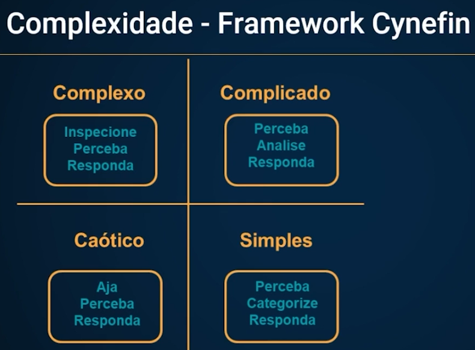
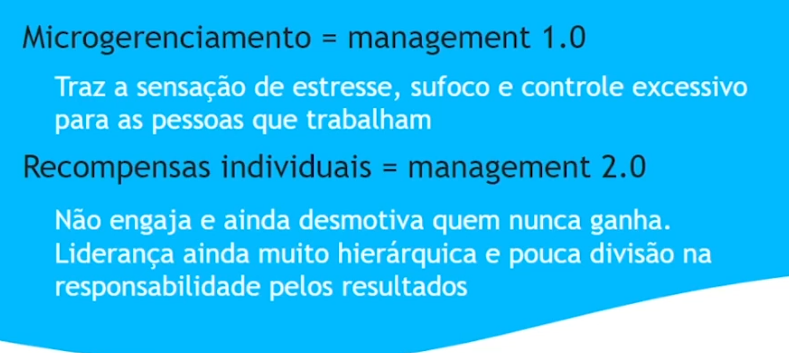
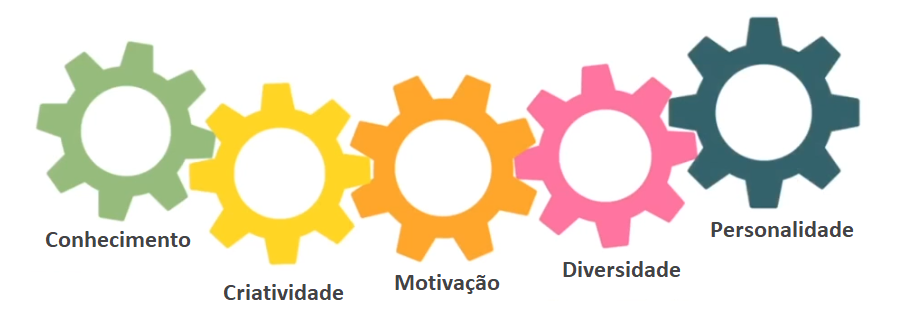
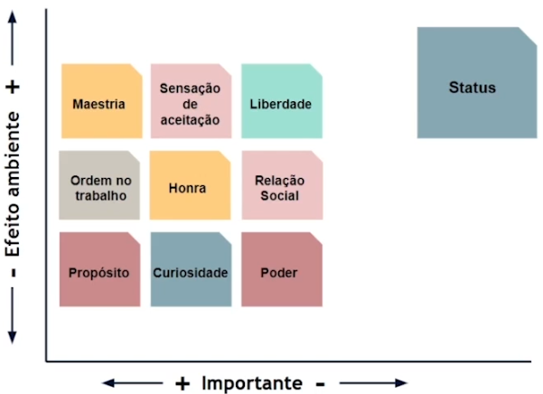
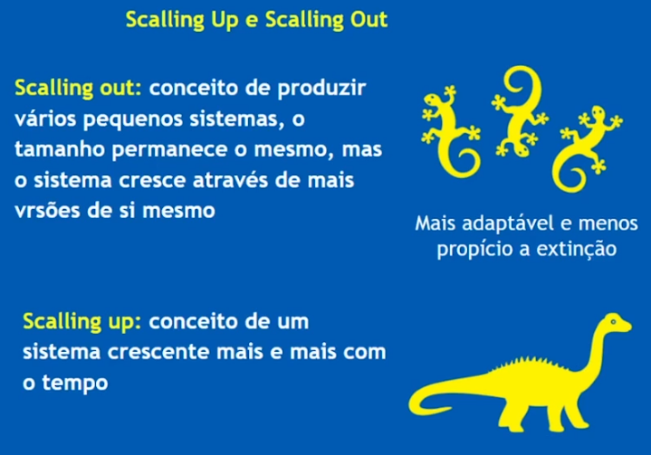

https://roadmap.sh/engineering-manager

___

Usabilidade vs Negócio vs Tecnolgia

- Atuação:
    - Pesquisa de mercado
    - Gerar um produto de qualidade
    - Entender o público

Produto: Conjunto de bens e serviços que resultam da atividade produtiva.

Gerar um bem de valor vendável e distribuível. O ciclo de vida pode ser dividido em: Introdução; crescimento; maturidade; e declínio. Assim, tem que criar estratégias para manter o produto na fase da maturidade.

Design Thinking: Método para estimular ideação e perspicácia ao abordar problemas, relacionados a futuras aquisições de informações, análise de conhecimento e propostas de soluções.

Modelo de Duplo Diamante:

Relizar pesquisa para descobrir sobre o mercado, pessoas e métodos.

Dados para contextualizar e embasar o produto podem ser primários (fonte, entrevista, observação, etc.) ou secundários (pesquisas anteriores, benchmark, bibiografia).

Mapa de Empatia: Entender a percepção do produto

Aprimorar um produto existente ou criar um novo produto?

Expansão da Marca:

- Ideação:
    - Proposta de valor
    - Criatividade
    - Brainstorm

Para conduzir as ideias promissoras da ideação, podemos utilizar a matriz de posicionamento:

Prototipação: Serve como instrumento de aprendizado, e combina com o ágil aliado ao CRISP-DM enquanto teste de modelos "menores" e exploração das features, dando segurança para seguir a diante. Diminui incertezas e otimiza o produto final, quando possível. Lembrando do método ágil: Errar rápido. O protótipo é uma fase anterior ao MVP.

Protótipos e MPVs podem ser testados com um público restrito para analisar sua fidelidade.

Métricas: Agregam valor para a entrega. KPIs para entregas de dados podem ser, por exemplo, retorno financeiro, economia de tempo em trabalho manual, NPS, ROI, etc.

SIPOC: Utilizado para mapear e visualizar o fluxo de um processo, fornecendo uma visão clara das interações entre fornecedores, entradas, processos, saídas e clientes.

VSM: Utilizada para analisar, visualizar e melhorar o fluxo de valor de um processo, geralmente dentro do contexto da melhoria contínua e da aplicação de princípios ágeis.

Jornada do Usuário: Utilizada na agilidade por sua simplicidade e eficácia na compreensão das necessidades dos usuários e na identificação de oportunidades de melhoria

"A vantagem de mapear processos é melhorar os processos".

Plan-Do-Check-Act

Boa relação e integração do time + dinâmicas estruturadas + propósito = maior rendimento

Definir o objetivo a ser alcançado

Tipos de Team Building:

Atividades para hard skills: Projeto em equipe, soluções de problemas, treinamento cruzado, simulação ou jogos, mentoria.

Atividades para soft skills: Palestras e workshops, desafios em grupos.

5w2h: What, why, who, where, when, how and how much.

Cultura de feedback: Diálogo presente e aberto, de forma educada e confortável, não violenta. É importante haver uma frequência nos feedbacks.

Tornar o momento de feedback algo habitual, e não um momento de confronto.

Fomentar um ambiente inclusivo.

## Gestão 3.0:

- Autonomia
- Colaboração
- Melhoria contínua
- Liderança distribuída
- Cultura de confiança e transparência
- Foco nas pessoas e interações
- Autogestão e responsabilidade individual

- Projetos:
    - Único
    - Objetivo definido
    - Temporário
    - Alta complexidade
    - Bastante planejamento

- Produtos:
    - Ciclo de vida contínuo
    - Melhorias e atualizações
    - Gestão do produto
    - Time de produto
    - Foco no valor para o cliente
    - Evolutivo

- 3.0:
    - Gerenciar o ambiente, e não pessoas.
    - Não realizar microgestão.
    - O time funciona como uma entidade para resolver uma tarefa complexa.
    - O time tem que estar no controle da sua gestão

## Project Managment Office (PMO)

???

    

## [[1] PMBOK: o que é e como é utilizado para gestão de projetos?](https://www.sydle.com/br/blog/pmbok-61e80383f41fbf069eb3ef2b)

O PMBOK norteia a gestão, fornecendo dados importantes para que empresas ao redor do mundo sigam direções uniformizadas, para reduzir falhas, melhorar o desempenho e ter uma previsão mais acertada sobre os resultados. Na 7a edição PMBOK: o PMBOK 7 é de 2021 e contempla abordagens ágeis, adaptativas e híbridas, e enfatiza a gestão de projetos orientada a mudanças.

É importante destacar que, embora muitas vezes seja citado assim, o PMBOK não é uma metodologia. O material é, na verdade, um guia de orientação de gerenciamento, mas que deve ser seguido de acordo com as necessidades e aspectos específicos do projeto.

De acordo com as definições do PMBOK, um projeto é um esforço temporário empreendido para criar um produto, serviço ou resultado exclusivo.

O gerenciamento de projetos PMBOK são conduzidos a partir de 5 subgrupos de processos: iniciação, planejamento, execução, monitoramento e controle, e encerramento.

1) Iniciação: Inclui a autorização para dar início ou não, além de definir um escopo inicial, que abrange as primeiras estimativas de custos. É neste processo que o gestor deve identificar as partes interessadas no projeto e começar os passos que antecedem a realização em si. Neste ponto, deve ser desenvolvido um documento que “oficializa a abertura do projeto” e contém informações importantes, que serão utilizadas também nos outros processos.

2) Planejamento: No planejamento, as atividades aumentam e ficam mais específicas. É neste subgrupo que se realizam tarefas como:
    - Plano de gerenciamento
    - Definição de escopo
    - Coleta de requisitos
    - Desenvolvimento de Estrutura Análitica do Projeto
    - Definição de cronograma e as atividades de cada etapa
    - Estimativa do tempo de duração de cada atividade
    - Estimativa de custos e definição de orçamento
    - Planejamento da gestão da qualidade e dos recursos disponíveis
    - Planejamento de comunicações
    - Identificação de riscos

3) Execução: Esse é grupo de processos em que o gestor de projetos define o que fazer, coordenando recursos humanos e materiais, além de motivar as partes envolvidas no projeto. As informações devem ser distribuídas para a equipe e o gerente deve conduzir todas as aquisições.

4) Monitoramento e Controle: Neste grupo de processos estão as atividades essenciais para avaliar o desempenho do projeto. É o momento de mostrar de onde se partiu e o quanto ainda falta para alcançar o objetivo traçado. esta etapa, ainda é possível fazer mudanças e estabelecer protocolos de alterações, mas sempre garantindo que não haja grandes variações. Esse grupo inclui processos como:
    - Monitoramento das etapas de trabalho
    - Controle sobre as mudanças
    - Validação e controle de escopo
    - Supervisão de cronograma
    - Monitoramento dos riscos
    - Acompanhamento das comunicações
    - Monitoramento das aquisições
    - Controle de custos
    - Reportes de desempenho.

5) Encerramento: O encerramento prevê que os resultados finais estejam alinhados aos parâmetros e critérios definidos anteriormente, com alcance dos objetivos e dos benefícios previstos. Nesse momento, espera-se que os seguintes resultados tenham sido obtidos:
    - Aceitação do cliente/usuário final
    - Objetivos do negócio e benefícios previstos atingidos
    - Objetivos do projeto alcançados
    - Validação e organização dos materiais usados no projeto

## [[2] Ser gerente de projetos: 6 dicas para se tornar um](https://blog.ipog.edu.br/engenharia-e-arquitetura/ser-gerente-de-projetos-6-dicas-para-se-tornar-um/)

1) Entender as necessidades do momento: Um gerente de projetos deve sempre perguntar “por que” e “para quê” realizar uma determinada atividade. Dessa forma, ele procura entender o que a empresa e a equipe precisam e como atender a demanda de forma satisfatória. Ao realizar este exercício estará realizando o gerenciamento de pessoas (stakeholders) e terá mais possibilidades de crescimento na carreira.

2) Ter capacidade de realização: O gerente de projetos é o líder da equipe e deve sempre pensar as decisões de forma positiva, com flexibilidade e tenacidade na hora de resolver os problemas. Portanto, deve estar sempre preparado para trabalhar no impasse, seja ele qual for, até que se encontre a solução ideal.

3) Ser um gerente de projetos exigente: Um bom gerente de projetos é exigente e detalhista, acompanha todo o trabalho do início ao fim, para garantir que ele realmente seja bem-feito, pois será cobrado pelo resultado de toda equipe.

4) Ter respeito com a equipe: O respeito deve prevalecer em quaisquer situações, portanto, deve-se evitar o conflito entre a equipe, evitando assim a perda de eficiência e produtividade. É importante que o gerente de projetos mantenha sempre a seriedade e serenidade, pois, caso haja excesso de companheirismo e amizade, sua equipe pode não te respeitar e, sem isso, não consegue atingir as suas metas propostas.

5) Valorizar a equipe: O gerente de projetos ao perceber que alguém da sua equipe se superou ou chamou a atenção de forma positiva, deve elogias, um elogio faz com que uma pessoa ou a equipe, trabalhe mais motivada e que produza resultados acima dos esperados.

6) Conhecer cursos e certificações de gerenciamento de projetos: ...

## [[3] Saiba tudo sobre PMBOK](https://blog.aevo.com.br/pmbok/)

Um dos pontos mais importantes do PMBoK para os projetos é que ele facilita a padronização. Assim, as atividades conseguem seguir uma lógica, melhorando todo o fluxo de dados e diminuindo os riscos. O que acaba gerando um aumento nos lucros e um maior controle em todo o resto da organização.

Os conhecimentos trazidos pelo PMBoK possibilitam os gestores a terem uma visão mais clara sobre todo o processo como um todo . Conseguindo assim padronizar processos e tornar a empresa mais eficiente, que gera um ganho de valor e uma melhor percepção do cliente.

Quais são os fatores:

    - Ambiental (e.g.: Fauna e flora)
    - Físicos e Infraestrutura (e.g.: Acomodação, distância, custos logísticos, etc.)
    - Humanos e Sociais (e.g.: Cultura da empresa, metodologias existentes)
    - Tecnológicos (e.g.: Softwares, hardware, etc)
    - Externos (e.g.: Legislação vigente, normativos)

Os processos trabalhados pelo PMBoK são complexos. Eles trazem uma verdadeira revolução quando implementados. São eles: 

    - Escopo
    - Tempo
    - Custos
    - Qualidade
    - Aquisições
    - Recursos humanos
    - Comunicação
    - Riscos
    - Partes stakeholders
    - Integração

PMBOK consiste de um macroprocesso.

